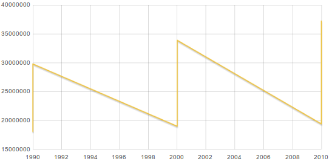
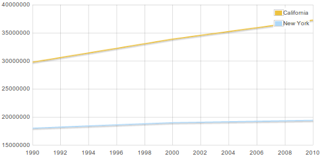
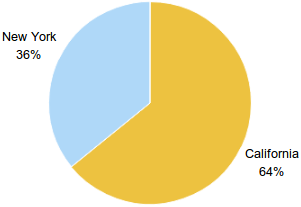

ckanext-basiccharts
===================

This extension adds Line, Bar and Pie charts to CKAN, using the new Resource
View being developed in https://github.com/ckan/ckan/tree/1251-resource-view.

It uses [Flot Charts](http://www.flotcharts.org), which is compatible with all
major browsers (including IE6+).

Installation
------------

To use it, simply clone this repository and run ```python setup.py install```.
Then add which charts you'd like to your ```ckan.plugins``` in your CKAN config
file.

You have to enable ```basiccharts``` before any of the other charts. Only then,
you can enable any (or all) of:

* linechart
* barchart
* piechart

Finally, restart your webserver. You should see the new chart types as options
in the view type's list on any resource that's in the DataStore.

Usage
-----

There are 3 kind of attributes that define what the chart will be: filters,
axes, and groups. We'll create charts in the next sections to define them all
using the following data:

| State      | Date       | Population   |
|------------|------------|--------------|
| California | 01-01-1990 | 29,760,021   |
| California | 01-01-2000 | 33,871,648   |
| California | 01-01-2010 | 37,253,956   |
| New York   | 01-01-1990 | 17,990,455   |
| New York   | 01-01-2000 | 18,976,457   |
| New York   | 01-01-2010 | 19,378,102   |

### Filters

If you don't want all data to be plotted in the chart, you can add filters.
Here, you define what to **include**.

For example, with the sample data, if you want to display just for California,
you'd create the filter:

```
State: California
```

Multiple filters on the same column work as ```OR```. For example, to plot just
the data for 01-01-2000 and 01-01-2010, you'd do:

```
Date: 01-01-2000
Date: 01-01-2010
```

Multiple filters on different columns work as ```AND```. If we'd add all
filters defined in the last paragraphs, we would plot data only for California
in 01-01-2000 or 01-01-2010. In techie terms, it'll be ```State == "California"
AND (Date == "01-01-2000" OR Date == "01-01-2010")```

Currently you can't exclude data, only include. There's no way to negate a
filter (to all states that are not California, for example).

### Axes

This defines what column will be plotted in each axis. Line and bar charts have
two axes, Y and X; pie charts only have one, Y.

As long as the DataStore interpreted the column types correctly, the charts
will work with any kind of data (numeric, text, or date). To check if this is
the case, check the ```Upload log``` in the ```Manage resource```'s
```DataStore``` tab. You should see something like:

```
Determined headers and types: [{'type': u'text', 'id': u'State'}, {'type':
u'timestamp', 'id': u'Date'}, {'type': u'numeric', 'id': u'Population'}]
```

Just confirm that the types defined are correct. If not, try to understand why
and fix it, as the charts created might behave incorrectly. The DataStore's
documentation might help you.

### Groups

This allows you to group the data being plotted, based on a certain column.
It's optional for bar and line charts, but required for pie charts.

For example, say that you want to create a line chart that shows California and
New York's population growth. You define ```Date``` to be your X axis, and
```Population``` to be your Y axis. Then, when you preview the chart, it'll be
like:



Not what you'd want. The problem is that when there's no group, all data is
groupped together. You'd like to separate the population from California from
the New York's. To do that, you need to group by ```State```.



Much better. Notice that there's a group's legend as well. To enable it, you
need to check ```Show groups' legend```.

The bar chart works similarly. The pie charts are a bit different. To define
them, you're required to set up a column to group by. With the same data, if
you'd want to create a chart for, given the sum of California and New York's
population, which percentage belongs to one and which to the other, you'd set
up group by as ```State```, and Y axis as ```Population```. That'll create:



As the legends are always embedded in the chart, there's no ```Show groups'
legend``` option.
